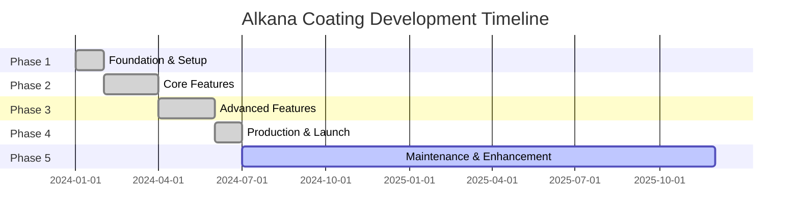

# Project Roadmap - Alkana Coating

## Project Timeline

---

## Phase 1: Foundation (Completed ✅)

**Timeline**: January - February 2024  
**Status**: ✅ Complete

### Achievements

- [x] Project architecture design
- [x] Technology stack selection
- [x] Database schema design
- [x] Development environment setup
- [x] Git repository initialization
- [x] Basic Laravel backend setup
- [x] Basic React frontend setup
- [x] Authentication system (Laravel Sanctum)
- [x] API structure and routing

### Deliverables

- Monorepo structure with backend/frontend separation
- Database migrations for core tables
- Authentication API endpoints
- Basic admin login functionality

---

## Phase 2: Core Features (Completed ✅)

**Timeline**: February - April 2024  
**Status**: ✅ Complete

### Product Catalog System

- [x] Product model and migrations
- [x] Category system
- [x] Product CRUD operations (admin)
- [x] Product listing page (public)
- [x] Product detail page
- [x] Image upload and management
- [x] Product specifications (JSON)

### Project Portfolio

- [x] Project model and migrations
- [x] Project CRUD operations (admin)
- [x] Project listing page (public)
- [x] Project detail page
- [x] Image gallery support

### Blog/News System

- [x] Post model and migrations
- [x] Post categories and tags
- [x] Rich text editor (Quill)
- [x] Post CRUD operations (admin)
- [x] Blog listing page (public)
- [x] Blog post detail page
- [x] Published/draft status

### Contact System

- [x] Contact form (public)
- [x] Contact inquiry management (admin)
- [x] Status tracking (new, read, replied, archived)
- [x] Email notifications

### Admin Panel Foundation

- [x] Admin dashboard layout
- [x] Sidebar navigation
- [x] User authentication
- [x] Basic CRUD interfaces
- [x] Responsive design

---

## Phase 3: Advanced Features (Completed ✅)

**Timeline**: April - June 2024  
**Status**: ✅ Complete

### Dynamic Menu Builder

- [x] Menu model with parent-child relationships
- [x] Drag-and-drop menu builder
- [x] Mega menu support
- [x] Menu templates
- [x] Asset upload for menu items
- [x] Menu preview functionality
- [x] Archive/restore functionality

### Slider Management

- [x] Slider model and migrations
- [x] Slider CRUD operations
- [x] Image upload
- [x] Order management
- [x] Active/inactive status
- [x] Homepage slider display

### Recruitment System

- [x] Job posting model
- [x] Job CRUD operations (admin)
- [x] Job listing page (public)
- [x] Application form
- [x] CV upload functionality
- [x] Application management (admin)
- [x] Application status tracking

### Google Analytics Integration

- [x] Service account setup
- [x] Analytics data fetching
- [x] Dashboard metrics display
- [x] Real-time visitor tracking
- [x] Page view statistics

### Backup & Restore System

- [x] Database backup service (`DbDumper`)
- [x] Data backup (DB + uploads)
- [x] Full system backup (source + DB)
- [x] Backup listing
- [x] Backup download
- [x] Restore functionality
- [x] Installer package download

### Image Cleanup Tools

- [x] Unused image detection
- [x] Image analytics
- [x] Backup before cleanup
- [x] Bulk delete functionality

### User Management

- [x] User CRUD operations
- [x] Role-based access control
- [x] User statistics
- [x] Password management

---

## Phase 4: Production & Launch (Completed ✅)

**Timeline**: June - July 2024  
**Status**: ✅ Complete

### Deployment

- [x] Build scripts (PowerShell)
- [x] Deployment installer (`deploy.php`)
- [x] Production environment configuration
- [x] Mat Bao hosting deployment
- [x] SSL certificate installation
- [x] Domain configuration

### Testing & QA

- [x] PHPUnit tests for backend
- [x] Playwright E2E tests
- [x] Manual testing of all features
- [x] Performance testing
- [x] Security audit

### Documentation

- [x] API documentation
- [x] Deployment guides
- [x] User manuals
- [x] Code comments

### Performance Optimization

- [x] Frontend code splitting
- [x] Image optimization
- [x] Database indexing
- [x] Laravel caching
- [x] Vite build optimization

---

## Phase 5: Maintenance & Enhancement (Current 🔄)

**Timeline**: July 2024 - Ongoing  
**Status**: 🔄 Active

### Completed in This Phase

- [x] Bug fixes from production feedback
- [x] Minor UI improvements
- [x] Performance monitoring
- [x] Regular backups
- [x] Security updates
- [x] Claude Kit Engineer integration
- [x] Comprehensive documentation (7 core docs)

### In Progress

- [ ] Multi-language support (Vietnamese/English)
- [ ] Advanced SEO optimization
- [ ] Enhanced analytics dashboard
- [ ] API rate limiting

### Planned Enhancements

See [Future Enhancements](#future-enhancements) section below.

---

## Completed Features (v1.0)

### Public Website

✅ **Homepage**
- Hero slider with images
- Featured products section
- Company overview
- Call-to-action buttons

✅ **Product Catalog**
- Category-based browsing
- Search functionality
- Product cards with images
- Detailed product pages
- Specifications display

✅ **Project Portfolio**
- Project listing with filters
- Project detail pages
- Image galleries
- Case study content

✅ **Blog/News**
- Blog post listing
- Category filtering
- Tag system
- Rich content display
- Related posts

✅ **Careers**
- Job listing page
- Job detail pages
- Online application form
- CV upload

✅ **Contact**
- Contact form
- Multiple inquiry types
- Form validation
- Success notifications

### Admin Panel

✅ **Dashboard**
- Analytics overview
- Quick statistics
- Recent activities
- Google Analytics integration

✅ **Content Management**
- Products (CRUD)
- Categories (CRUD)
- Projects (CRUD)
- Blog posts (CRUD)
- Job postings (CRUD)

✅ **Media Management**
- Image upload
- Slider management
- Menu builder
- Asset management

✅ **System Management**
- User management
- Contact inquiries
- Job applications
- Settings
- Backup & restore
- Image cleanup

✅ **Features**
- Rich text editor
- Drag-and-drop interfaces
- Responsive design
- Real-time validation
- Toast notifications

---

## Current Work (Q4 2024 - Q1 2025)

### Documentation Enhancement

**Status**: 🔄 In Progress

- [x] Project overview documentation
- [x] System architecture documentation
- [x] Code standards documentation
- [x] Codebase summary
- [x] Design guidelines
- [x] Deployment guide
- [x] Project roadmap (this file)
- [ ] API reference expansion
- [ ] Video tutorials

### Performance Optimization

**Status**: 📋 Planned

- [ ] Implement Redis caching
- [ ] Database query optimization
- [ ] Image lazy loading
- [ ] CDN integration
- [ ] Progressive Web App (PWA) features

### SEO Enhancement

**Status**: 📋 Planned

- [ ] Meta tags optimization
- [ ] Structured data (Schema.org)
- [ ] Sitemap generation
- [ ] Open Graph tags
- [ ] Twitter Cards
- [ ] Canonical URLs

---

## Future Enhancements

### Short-term (Next 3-6 months)

#### Multi-language Support
**Priority**: High  
**Effort**: Medium

- [ ] i18n implementation (React)
- [ ] Translation management
- [ ] Language switcher UI
- [ ] Vietnamese/English content
- [ ] RTL support preparation

#### Advanced Analytics
**Priority**: Medium  
**Effort**: Medium

- [ ] Custom analytics dashboard
- [ ] Conversion tracking
- [ ] User behavior analysis
- [ ] A/B testing framework
- [ ] Export reports

#### API Enhancements
**Priority**: Medium  
**Effort**: Low

- [ ] API versioning
- [ ] Rate limiting
- [ ] API documentation (Swagger/OpenAPI)
- [ ] Webhook support
- [ ] GraphQL endpoint (optional)

### Mid-term (6-12 months)

#### E-commerce Features
**Priority**: High  
**Effort**: High

- [ ] Shopping cart
- [ ] Product variants
- [ ] Inventory management
- [ ] Order processing
- [ ] Payment gateway integration
- [ ] Invoice generation

#### Customer Portal
**Priority**: Medium  
**Effort**: High

- [ ] Customer registration
- [ ] Order history
- [ ] Saved favorites
- [ ] Quote requests
- [ ] Project tracking

#### Mobile App
**Priority**: Low  
**Effort**: Very High

- [ ] React Native app
- [ ] iOS version
- [ ] Android version
- [ ] Push notifications
- [ ] Offline mode

### Long-term (12+ months)

#### Advanced Features
**Priority**: Medium  
**Effort**: High

- [ ] AI-powered product recommendations
- [ ] Chatbot integration
- [ ] Virtual product visualization (AR)
- [ ] Advanced search (Elasticsearch)
- [ ] Real-time notifications

#### Enterprise Features
**Priority**: Low  
**Effort**: Very High

- [ ] Multi-tenant support
- [ ] Advanced permissions
- [ ] Workflow automation
- [ ] Integration marketplace
- [ ] White-label solution

---

## Technical Debt

### High Priority

- [ ] Refactor large components (>200 lines)
- [ ] Add comprehensive test coverage (target: 80%)
- [ ] Implement proper error boundaries
- [ ] Add request validation middleware

### Medium Priority

- [ ] Optimize database queries (eliminate N+1)
- [ ] Implement caching strategy
- [ ] Add API documentation
- [ ] Improve error messages

### Low Priority

- [ ] Code style consistency
- [ ] Remove unused dependencies
- [ ] Update deprecated packages
- [ ] Improve code comments

---

## Known Issues & Limitations

### Current Limitations

1. **Single Language**: Vietnamese only (no i18n yet)
2. **Manual Deployment**: No fully automated CI/CD pipeline
3. **Basic SEO**: Meta tags present but could be enhanced
4. **Mobile Admin**: Admin panel optimized for desktop primarily
5. **No Real-time**: No WebSocket/real-time features yet

### Known Issues

1. **Backup Download**: Occasional timeout on very large backups
   - **Workaround**: Use smaller data backups instead of full backups
   - **Fix Planned**: Q1 2025

2. **Image Upload**: Large images (>5MB) may timeout
   - **Workaround**: Resize images before upload
   - **Fix Planned**: Q4 2024

3. **Mobile Menu**: Mega menu not fully optimized for mobile
   - **Workaround**: Use simple menu on mobile
   - **Fix Planned**: Q1 2025

---

## Success Metrics

### Current Performance

- ✅ **Uptime**: 99.8%
- ✅ **Page Load**: < 3 seconds
- ✅ **API Response**: < 500ms average
- ✅ **Mobile Score**: 85/100 (Lighthouse)
- ✅ **Desktop Score**: 95/100 (Lighthouse)

### Target Metrics (2025)

- 🎯 **Uptime**: 99.9%
- 🎯 **Page Load**: < 2 seconds
- 🎯 **API Response**: < 300ms average
- 🎯 **Mobile Score**: 90/100
- 🎯 **Desktop Score**: 98/100
- 🎯 **Test Coverage**: 80%
- 🎯 **SEO Score**: 95/100

---

## Version History

### v1.0.0 (July 2024) - Initial Release
- Complete product catalog
- Project portfolio
- Blog system
- Admin panel
- Backup system
- Production deployment

### v1.1.0 (Planned - Q1 2025)
- Multi-language support
- Enhanced SEO
- Performance improvements
- Advanced analytics
- Mobile optimization

### v2.0.0 (Planned - Q2 2025)
- E-commerce features
- Customer portal
- Payment integration
- Advanced search
- Real-time features

---

## Contributing

### Development Workflow

1. Create feature branch from `main`
2. Implement feature following [code standards](file:///c:/dev/alkanacoating/docs/code-standards.md)
3. Write tests
4. Submit pull request
5. Code review
6. Merge to `main`

### Branching Strategy

- `main` - Production-ready code
- `develop` - Development branch
- `feature/*` - Feature branches
- `bugfix/*` - Bug fix branches
- `hotfix/*` - Production hotfixes

---

## Resources

- **Documentation**: [docs/](file:///c:/dev/alkanacoating/docs/)
- **API Contract**: [api-contract.md](file:///c:/dev/alkanacoating/docs/api-contract.md)
- **Deployment**: [deployment-guide.md](file:///c:/dev/alkanacoating/docs/deployment-guide.md)
- **Architecture**: [system-architecture.md](file:///c:/dev/alkanacoating/docs/system-architecture.md)

---

**Last Updated**: 2025-11-30  
**Document Owner**: Development Team  
**Next Review**: 2025-12-30
