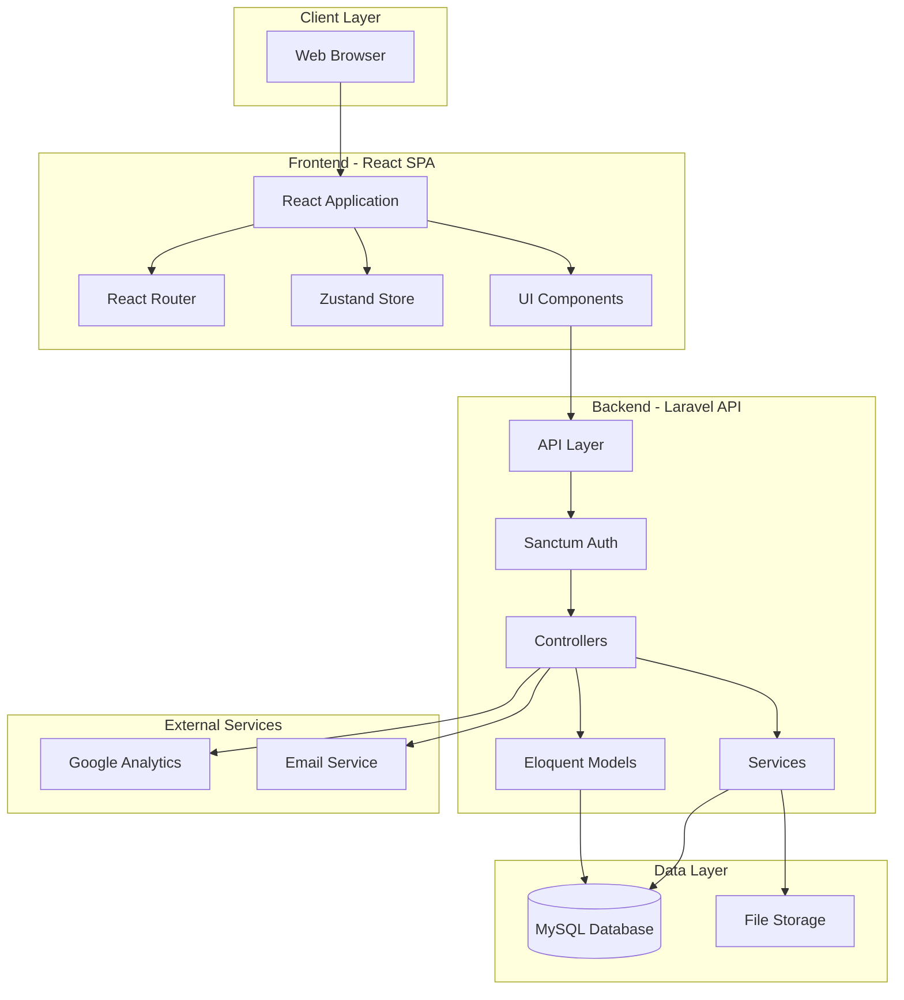
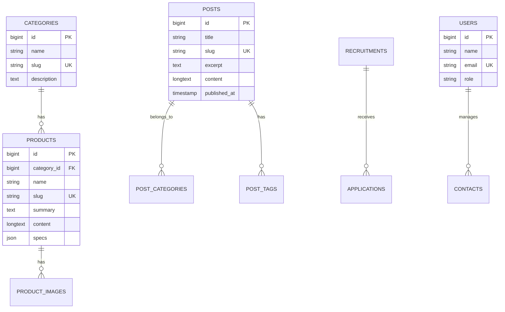
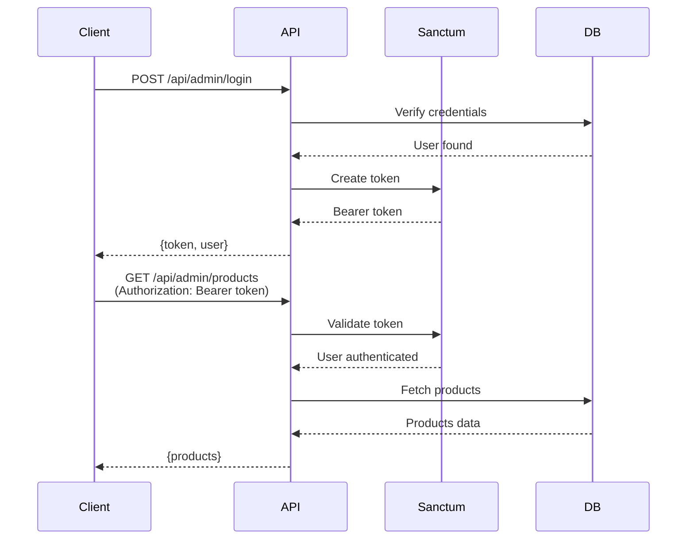
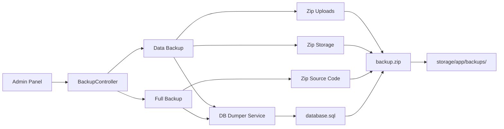
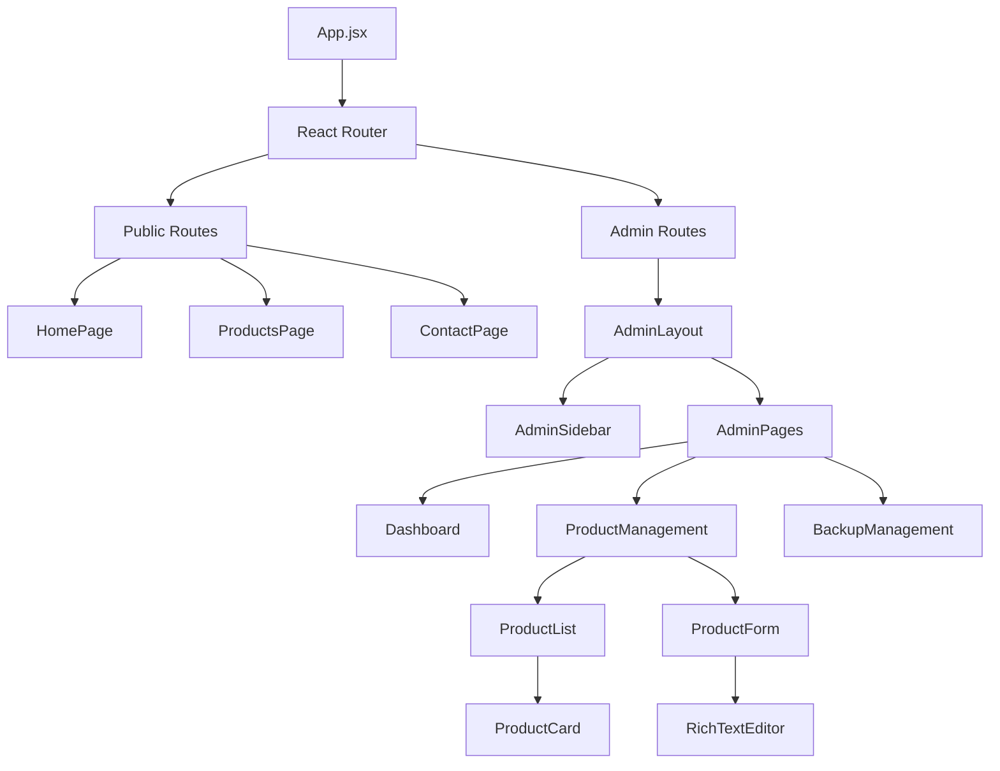
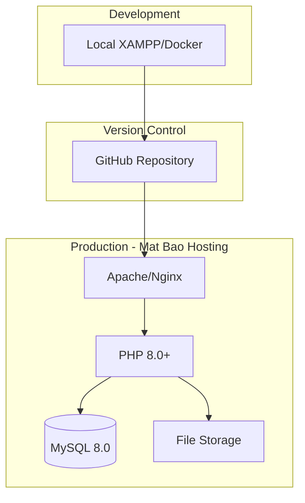

# System Architecture - Alkana Coating

## Architecture Overview

Alkana Coating follows a **monorepo architecture** with separated backend and frontend, communicating via RESTful API.



## Backend Architecture (Laravel)

### Directory Structure

```
backend/
├── app/
│   ├── Http/
│   │   ├── Controllers/
│   │   │   ├── Api/              # Public API controllers
│   │   │   ├── Admin/            # Admin-only controllers
│   │   │   └── AdminController.php
│   │   └── Middleware/
│   ├── Models/                   # Eloquent models
│   ├── Services/                 # Business logic services
│   └── Providers/
├── config/                       # Configuration files
├── database/
│   ├── migrations/               # Database migrations
│   ├── seeders/                  # Data seeders
│   └── factories/                # Model factories
├── routes/
│   ├── api.php                   # Public API routes
│   └── api_admin.php             # Admin API routes
├── storage/
│   └── app/
│       ├── backups/              # System backups
│       └── public/               # Public file storage
└── public/
    └── uploads/                  # Uploaded images
```

### Key Components

#### Controllers

**Public API Controllers** (`app/Http/Controllers/Api/`)
- `ProductController` - Product catalog operations
- `ProjectController` - Project portfolio
- `PostController` - Blog/news posts
- `ContactController` - Contact form handling
- `MenuController` - Dynamic menu system
- `SliderController` - Homepage sliders

**Admin Controllers** (`app/Http/Controllers/Admin/`)
- `BackupController` - Backup & restore operations
- `UserController` - User management
- `CategoryController` - Category management
- `ImageCleanupController` - Image optimization
- `GoogleAnalyticsController` - Analytics data

#### Models

Key Eloquent models with relationships:



#### Services

**Custom Services** (`app/Services/`)
- `DbDumper` - Database backup generation
  - Exports full MySQL dump with structure and data
  - Handles foreign key constraints
  - Escapes special characters

### API Architecture

#### Authentication Flow



#### API Endpoints Structure

**Public Routes** (`/api`)
- Health check, company info
- Product catalog (read-only)
- Project portfolio (read-only)
- Blog posts (read-only)
- Contact form submission

**Admin Routes** (`/api/admin`)
- Authentication (login/logout)
- Full CRUD for all resources
- Backup operations
- Analytics data
- User management

### Backup System Architecture



## Frontend Architecture (React)

### Directory Structure

```
frontend/src/
├── admin/                        # Admin panel
│   ├── components/               # Admin-specific components
│   ├── pages/                    # Admin pages
│   └── AdminRoutes.jsx           # Admin routing
├── components/                   # Shared components
│   ├── Header.jsx
│   ├── Footer.jsx
│   ├── ProductCard.jsx
│   └── ...
├── pages/                        # Public pages
│   ├── HomePage.jsx
│   ├── ProductsPage.jsx
│   ├── ContactPage.jsx
│   └── ...
├── features/                     # Feature modules
│   ├── products/
│   ├── projects/
│   └── ...
├── services/                     # API services
│   ├── api.js                    # Axios instance
│   └── adminApi.js               # Admin API calls
├── stores/                       # Zustand stores
│   ├── authStore.js              # Authentication state
│   └── adminStore.js             # Admin state
├── hooks/                        # Custom React hooks
├── utils/                        # Utility functions
└── App.jsx                       # Main app component
```

### Component Architecture



### State Management

**Zustand Stores**:

1. **authStore** - Authentication state
   - User info
   - Token management
   - Login/logout actions

2. **adminStore** - Admin panel state
   - Loading states
   - Error handling
   - Cache management

### Routing Structure

```
/                           # Homepage
/products                   # Product catalog
/products/:slug             # Product detail
/projects                   # Project portfolio
/projects/:slug             # Project detail
/news                       # Blog listing
/news/:slug                 # Blog post
/careers                    # Job listings
/contact                    # Contact page

/admin                      # Admin dashboard
/admin/login                # Admin login
/admin/products             # Product management
/admin/projects             # Project management
/admin/posts                # Post management
/admin/backups              # Backup management
/admin/settings             # Settings
```

## Database Architecture

### Schema Overview

See [schema.sql](file:///c:/dev/alkanacoating/docs/schema.sql) for base schema.

**Key Tables**:
- `users` - Admin users
- `categories` - Product categories
- `products` - Product catalog
- `projects` - Project portfolio
- `posts` - Blog posts
- `post_categories` - Blog categories
- `post_tags` - Blog tags
- `menus` - Dynamic menu system
- `sliders` - Homepage sliders
- `contacts` - Contact inquiries
- `recruitments` - Job postings
- `applications` - Job applications
- `settings` - System settings

### Indexing Strategy

- Primary keys on all `id` columns
- Unique indexes on `slug` columns
- Foreign key indexes for relationships
- Composite indexes on frequently queried columns

## Deployment Architecture



### Production Environment

**Server Stack**:
- Web Server: Apache with mod_rewrite
- PHP: 8.0+ with required extensions
- Database: MySQL 8.0
- Document Root: `/public` (Laravel public folder)

**Build Process**:
1. Frontend: `npm run build` → `dist/`
2. Backend: `composer install --no-dev`
3. Merge frontend build into Laravel public
4. Upload to hosting via FTP/deployment script

## External Integrations

### Google Analytics

- Service account authentication
- Real-time data fetching
- Dashboard metrics display
- JSON credentials stored in `storage/app/analytics/`

### Email Service

- Laravel Mail system
- SMTP configuration via `.env`
- Contact form notifications
- Application notifications

## Security Architecture

### Authentication
- Laravel Sanctum for SPA authentication
- CSRF protection enabled
- Token-based API access
- Secure password hashing (bcrypt)

### Authorization
- Role-based access control (admin/user)
- Middleware protection on admin routes
- Frontend route guards

### Data Protection
- SQL injection prevention (Eloquent ORM)
- XSS protection (React escaping)
- File upload validation
- Input sanitization

## Performance Considerations

### Backend Optimization
- Eloquent query optimization
- Eager loading to prevent N+1 queries
- Database indexing
- Response caching where appropriate

### Frontend Optimization
- Code splitting with React.lazy
- Image optimization
- Vite build optimization
- Tailwind CSS purging

---

**Last Updated**: 2025-11-30  
**Document Owner**: Development Team
